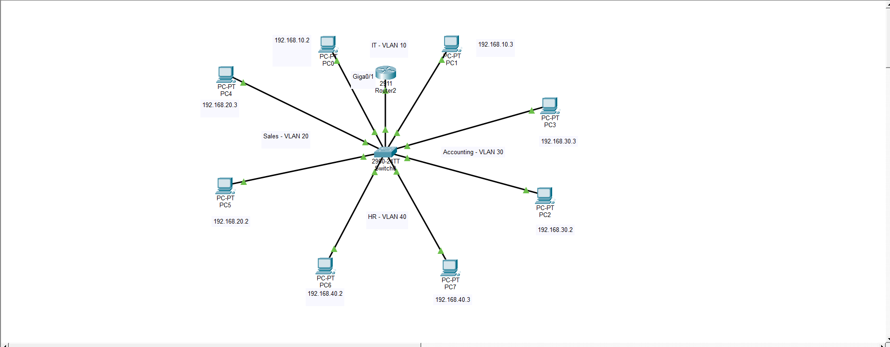

# Lab 01 — VLAN Segmentation + Router-on-a-Stick

**Tool:** Cisco Packet Tracer 9.0  
**Hardware (simulated):** Cisco 2911 Router, Cisco 2960-24TT Switch  
**Verified:** All intra-VLAN and inter-VLAN pings successful

---

## Topology Diagram



*4 VLANs, 8 PCs, 1 switch, 1 router — all inter-VLAN routing verified via ping.*

---

## Objective

Design a multi-department office network where each department operates on its own isolated subnet. A single router handles all inter-department routing using the Router-on-a-Stick (ROAS) method — one physical uplink from the router to the switch, carrying all VLANs via 802.1Q trunking, with logical subinterfaces handling each VLAN's traffic.

---

## Why This Design

The core problem this solves: without VLANs, every device on a switch shares a single broadcast domain. Every ARP request and discovery packet hits all 8 devices simultaneously. In a real office, that means Sales traffic is visible on HR ports, IT admin broadcasts reach every workstation, and the network has no logical segmentation at all.

VLANs fix this by creating isolated Layer 2 segments on a single physical switch. Departments can't reach each other unless traffic is explicitly routed — which is where the router comes in.

ROAS was chosen over a Layer 3 switch because:
- It's the standard approach when you have one router and one switch
- It demonstrates 802.1Q trunking, subinterface configuration, and inter-VLAN routing concepts clearly
- A Layer 3 switch would handle this with SVIs — that's Lab 02's territory

---

## Topology

```
[PC0] [PC1]         IT — VLAN 10
[PC4] [PC5]         Sales — VLAN 20
[PC2] [PC3]         Accounting — VLAN 30
[PC6] [PC7]         HR — VLAN 40
       |
  [2960-24TT Switch]
       |  (802.1Q Trunk — Giga0/1)
  [2911 Router]
```

All 8 PCs connect to the switch via access ports. The switch connects to the router via a single trunk link on GigabitEthernet 0/1. The router runs four subinterfaces — one per VLAN — each acting as the default gateway for its subnet.

---

## IP Addressing

| VLAN | Department | Subnet | Gateway | PC A | PC B |
|------|-----------|--------|---------|------|------|
| 10 | IT | 192.168.10.0/24 | 192.168.10.1 | PC0 — 192.168.10.2 | PC1 — 192.168.10.3 |
| 20 | Sales | 192.168.20.0/24 | 192.168.20.1 | PC4 — 192.168.20.3 | PC5 — 192.168.20.2 |
| 30 | Accounting | 192.168.30.0/24 | 192.168.30.1 | PC2 — 192.168.30.2 | PC3 — 192.168.30.3 |
| 40 | HR | 192.168.40.0/24 | 192.168.40.1 | PC6 — 192.168.40.2 | PC7 — 192.168.40.3 |

**Convention:** `.1` reserved for the router gateway. Hosts start at `.2`. This keeps addressing predictable when DHCP is added later.

---

## Switch Configuration

```
Switch> enable
Switch# configure terminal

! Create VLANs and name them
Switch(config)# vlan 10
Switch(config-vlan)# name IT
Switch(config-vlan)# vlan 20
Switch(config-vlan)# name Sales
Switch(config-vlan)# vlan 30
Switch(config-vlan)# name Accounting
Switch(config-vlan)# vlan 40
Switch(config-vlan)# name HR
Switch(config-vlan)# exit

! Assign access ports — one per PC, matched to its VLAN
! Repeat this block for each PC port, changing the VLAN number to match
Switch(config)# interface fastEthernet 0/1
Switch(config-if)# switchport mode access
Switch(config-if)# switchport access vlan 10
Switch(config-if)# exit

! Configure trunk port to router (carries all VLANs on one link)
Switch(config)# interface gigabitEthernet 0/1
Switch(config-if)# switchport mode trunk
Switch(config-if)# switchport trunk allowed vlan 10,20,30,40
Switch(config-if)# exit

Switch# write memory
```

**Verify VLAN assignments:**
```
Switch# show vlan brief
```

---

## Router Configuration

```
Router> enable
Router# configure terminal

! Bring up the physical interface first — subinterfaces inherit this state
Router(config)# interface gigabitEthernet 0/1
Router(config-if)# no shutdown
Router(config-if)# exit

! VLAN 10 — IT
Router(config)# interface gigabitEthernet 0/1.10
Router(config-subif)# encapsulation dot1Q 10
Router(config-subif)# ip address 192.168.10.1 255.255.255.0
Router(config-subif)# no shutdown
Router(config-subif)# exit

! VLAN 20 — Sales
Router(config)# interface gigabitEthernet 0/1.20
Router(config-subif)# encapsulation dot1Q 20
Router(config-subif)# ip address 192.168.20.1 255.255.255.0
Router(config-subif)# no shutdown
Router(config-subif)# exit

! VLAN 30 — Accounting
Router(config)# interface gigabitEthernet 0/1.30
Router(config-subif)# encapsulation dot1Q 30
Router(config-subif)# ip address 192.168.30.1 255.255.255.0
Router(config-subif)# no shutdown
Router(config-subif)# exit

! VLAN 40 — HR
Router(config)# interface gigabitEthernet 0/1.40
Router(config-subif)# encapsulation dot1Q 40
Router(config-subif)# ip address 192.168.40.1 255.255.255.0
Router(config-subif)# no shutdown
Router(config-subif)# exit

Router# write memory
```

**Verify subinterfaces are up:**
```
Router# show ip interface brief
Router# show ip route
```

---

## Verification

```
! Same-VLAN test (routed by switch alone)
PC0> ping 192.168.10.3      ! IT → IT

! Cross-VLAN tests (must pass through router)
PC0> ping 192.168.20.3      ! IT → Sales
PC0> ping 192.168.30.2      ! IT → Accounting
PC0> ping 192.168.40.2      ! IT → HR
```

**Result:** All pings successful. Intra-VLAN and inter-VLAN routing confirmed across all 4 departments.

---

## Errors & Fixes

| Error | Cause | Fix |
|-------|-------|-----|
| Cross-VLAN ping fails, same-VLAN works | Subinterface down or parent interface not `no shutdown` | Run `show ip int br` — parent Giga0/1 must show `up/up` |
| All pings fail after configuring VLANs | PC gateway not set or set to wrong IP | Each PC's default gateway must match its VLAN's subinterface IP |
| `show vlan brief` shows ports in VLAN 1 | Access port not assigned to correct VLAN | Re-enter `switchport access vlan [id]` on the correct interface |
| Trunk not passing all VLANs | Allowed VLAN list missing an ID | `switchport trunk allowed vlan 10,20,30,40` on trunk port |

---

## What This Lab Demonstrates

- **VLAN segmentation** — isolating department traffic at Layer 2 on a single physical switch
- **802.1Q trunking** — carrying multiple VLANs over a single uplink using tagged frames
- **Router-on-a-Stick** — using subinterfaces to route between VLANs without a Layer 3 switch
- **IP address planning** — reserving gateway addresses before assigning hosts
- **Systematic troubleshooting** — isolating failures by testing intra-VLAN before cross-VLAN

---

## What's Missing (Addressed in Lab 02)

This lab has no redundancy and no security boundary:

- **Single switch** — one hardware failure kills the entire network
- **No firewall** — all VLANs can reach each other freely; HR can ping IT servers
- **No external access simulation** — there is no representation of outside connectivity

Lab 02 addresses all three: a second switch for redundancy, a second router simulating an external vendor connection, and a firewall between the external router and the internal network to enforce a security boundary.
